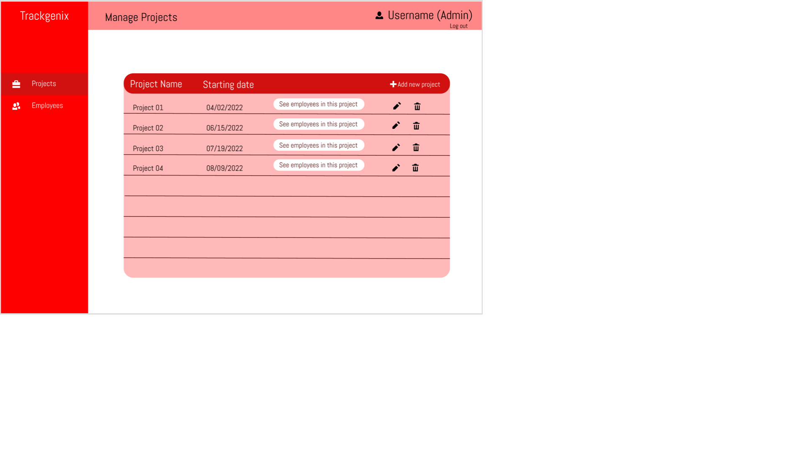

# Trackgenix
## A tool designed to improve productivity and work managment
Software goal: 

        This product offers the possibility to manage the time registration of each employee in your company,
        as well as being able to designate roles and projects to fulfill in a certain time

## Usage
        Once logged in, you can view the project table and be able to perform different actions such as adding, designating, etc.
        

## Steps to follow


``` 
    1- Open BASP-A2022-SEMANA-2
    2- Run Index.html
``` 
``` 
Week 2 
``` 
        General structure in html.
``` 
Week 3
``` 
        Apply the first concepts of css.
``` 
Week 4
```     
        Introduce Flexbox.
``` 
Week 5
```     
        Introduce Js, exercises to practice
``` 
Week 6
```     
        Introduce Js, Validations
``` 
Week 7
```     
        Introduce Js, Fetch & Modals
``` 


##  Authors and acknowledgment
 
My name is Horacio Duarte and this is possible by the Radium-Rocket team.